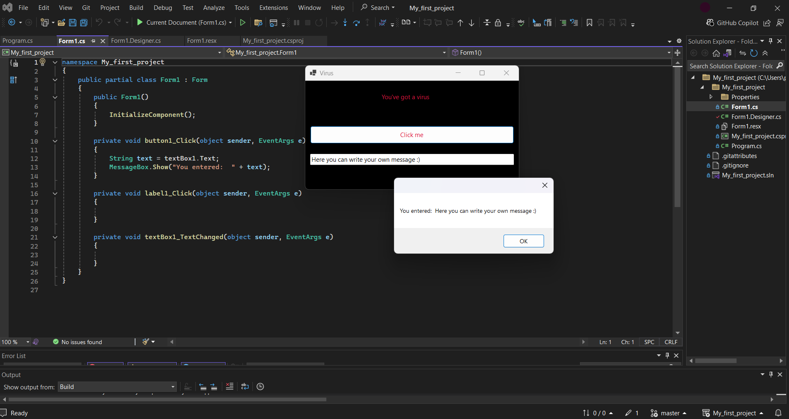

## Table of contents
* [General info](#general-info)
* [Technologies](#technologies)
* [Setup](#setup)

## General info
This simple project is for creating windows forms applications in C# using Visual Studio.  
Quick and easy way to write your forms, and adjust it to your needs.  
## Technologies
Project is created with:
* Visual Studio 2022
	
## Setup
To run this project, just install and run the files in Visual Studio. 
The project allows for customizing windows forms.

